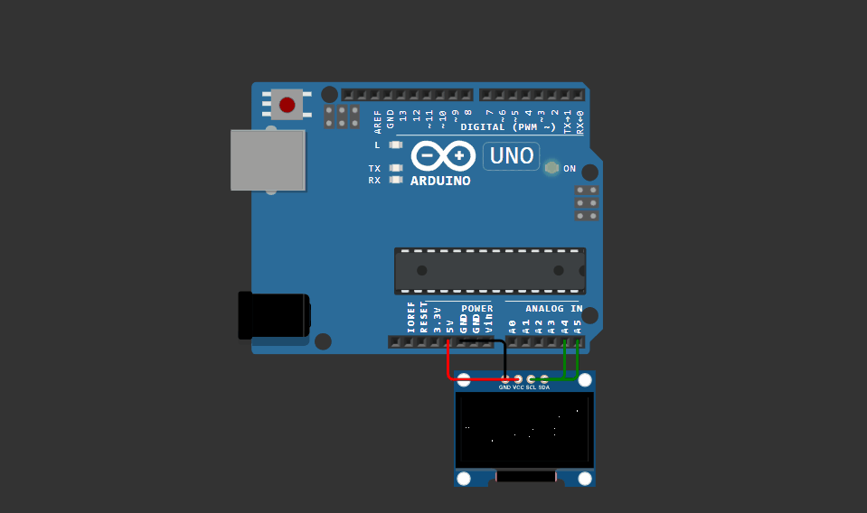

# spawn-oled-boot

An animated boot splash for the Spawn.Co logo, running on an Arduino Uno with a
128x64 SSD1306 OLED.

## What it does

The sequence loops every eight seconds:

| Time | Screen |
| --- | --- |
| 0.0s to 0.8s | a four pointed sparkle grows in |
| 0.8s to 3.5s | the logo, two interlocking crescents, appears beside it |
| 3.5s to 7.0s | the SPAWN.CO wordmark |
| 7.0s to 8.0s | the starfield speeds up, then the sequence restarts |

A 25 star field runs behind all of it. Each star holds an x, y and a depth, and
gets projected to the screen by dividing by that depth, so stars near the viewer
move faster and sit further from the centre.

## Hardware

- Arduino Uno
- SSD1306 OLED, 128x64, I2C, address 0x3C

## Wiring

| OLED | Uno |
| --- | --- |
| GND | GND |
| VCC | 5V |
| SCL | A5 |
| SDA | A4 |

## Running it

The quickest way is Wokwi, which needs no hardware. Create a new Arduino Uno
project, then replace `sketch.ino` and `diagram.json` with the ones here.

For real hardware, open `sketch.ino` in the Arduino IDE, install the two
libraries below through the Library Manager, and upload.

## Libraries

- Adafruit GFX Library
- Adafruit SSD1306

## Files

| File | |
| --- | --- |
| `sketch.ino` | the sketch |
| `diagram.json` | Wokwi wiring |
| `libraries.txt` | Wokwi library list |
| `SPAWN.CO.gif` | recording of the sequence |
